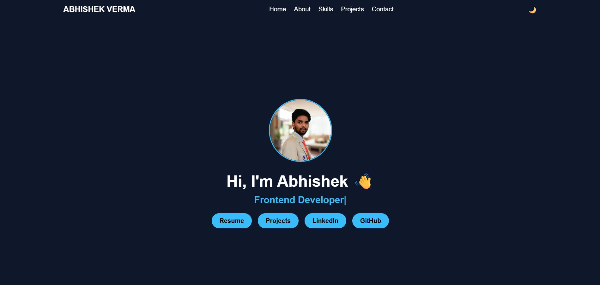

# 🌐 Personal Portfolio Website

This is my personal portfolio website built to showcase my skills, projects, and frontend development experience.

## 🚀 Live Preview
👉 [Portfolio](https://abhiishx-ai.github.io/portfolio-website/)

---

## 📌 Features

- Responsive design (mobile + desktop)
- Smooth scrolling navigation
- Dark / Light mode toggle 🌙
- Typing animation effect
- Project showcase section
- Clean and modern UI

---

## 🛠️ Tech Stack

- HTML5
- CSS3
- JavaScript
- AOS (Animate on Scroll)
- Typed.js

---

## 📸 Screenshots

---

## 🔗 Connect with Me

- LinkedIn: https://linkedin.com/in/abhishx
- GitHub: https://github.com/abhiishx

---

## 📧 Contact

Email: abhiishx@email.com

---

## ⭐ Author

👤 Abhishek Verma
Frontend Developer

---

## 📜 License

This project is open source and available under the MIT License.